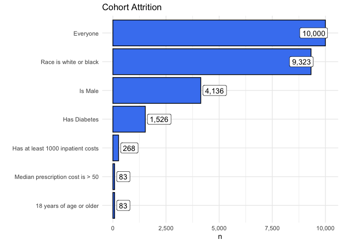
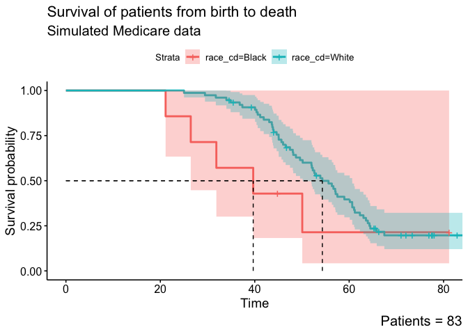

Using R to derive robust insights from real-world healthcare data
================

# Load data

``` r
tables_02 <- receive_delivery_02()

tables_02_etl_02 <- tables_02 %>%
  etl_02()
```

# QC

## Patients

``` r
# Run on the patients data
patients_interrogation <- tables_02_etl_02$patients %>%
  create_agent(
    tbl_name = "Patients",
    label = "Patients data (Post ETL 02)"
  ) %>%
  expectations_patients() %>%
  interrogate()

# Look at tidy results
patients_interrogation %>%
  tidy_interrogation() %>%
  knitr::kable()
```

    ## ✔ All Pass No failures across all 13 Tests!

| fail_n | test                                             | column         | any_fail |
|-------:|:-------------------------------------------------|:---------------|:---------|
|      0 | Key columns exist                                | birth_dt       | FALSE    |
|      0 | No one born before 01-01-1900                    | birth_dt       | FALSE    |
|      0 | Key columns exist                                | cncr           | FALSE    |
|      0 | Expect both patients with and without cancer     | cncr           | FALSE    |
|      0 | Key columns exist                                | death_dt       | FALSE    |
|      0 | No one born before 01-01-1900                    | death_dt       | FALSE    |
|      0 | Expect both patients with and without death info | death_observed | FALSE    |
|      0 | Key columns exist                                | desynpuf_id    | FALSE    |
|      0 | Table is ORPP                                    | desynpuf_id    | FALSE    |
|      0 | Key columns exist                                | diabetes       | FALSE    |
|      0 | Key columns exist                                | race_cd        | FALSE    |
|      0 | Key columns exist                                | sex_ident_cd   | FALSE    |
|      0 | Expect both Male and Female patients             | sex_ident_cd   | FALSE    |

## Inpatient

``` r
inpatient_interrogation <- tables_02_etl_02$inpatient %>%
  create_agent(
    tbl_name = "Inpatient",
    label = "Inpatient data (Post ETL 02)"
  ) %>%
  expectations_inpatient() %>%
  interrogate()

# Look at tidy results
inpatient_interrogation %>%
  tidy_interrogation() %>%
  knitr::kable()
```

    ## ✔ All Pass No failures across all 4 Tests!

| fail_n | test                             | column      | any_fail |
|-------:|:---------------------------------|:------------|:---------|
|      0 | Claim admin is a date            | clm_from_dt | FALSE    |
|      0 | Claim payment amount is positive | clm_pmt_amt | FALSE    |
|      0 | Claim admin is a date            | clm_thru_dt | FALSE    |
|      0 | Key columns exist                | desynpuf_id | FALSE    |

## ORPP

``` r
orpp_tbl <- tables_02_etl_02$patients %>%
  add_orpp_inpatient(inpatient_tbl = tables_02_etl_02$inpatient) %>%
  add_orpp_prescription(prescription_tbl = tables_02_etl_02$prescription)
```

    ## ℹ ORPP | Added 5 var(s) from inpatient:

    ## • has_inpatient_claims = Flag if patient has any inpatient claims

    ## • inpatient_claims_n = Number of inpatient claims

    ## • inpatient_payment_median = Median dollar amount of inpatient claims

    ## • inpatient_payment_min = Minimum dollar amount of inpatient claims

    ## • inpatient_payment_max = Maximum dollar amount of inpatient claims

    ## ℹ ORPP | Added 5 var(s) from prescription:

    ## • has_prescription = Flag if patient has any prescriptions

    ## • prescription_n = Number of prescription events

    ## • prescription_patient_payment_median = Median patient prescription payment
    ##   amount

    ## • prescription_rx_cost_median = Median prescription total cost amount

    ## • prescription_patient_payment_percentage_median = Median percentage of total
    ##   prescription cost paid by patient

``` r
orpp_interrogation <- create_agent(orpp_tbl,
  tbl_name = "ORPP cohort",
  label = "Patient level table"
) %>%
  expectations_orpp() %>%
  interrogate()

# Print result
orpp_interrogation %>%
  tidy_interrogation() %>%
  knitr::kable()
```

    ## ✔ All Pass No failures across all 2 Tests!

| fail_n | test                                  | column         | any_fail |
|-------:|:--------------------------------------|:---------------|:---------|
|      0 | Table is ORPP                         | desynpuf_id    | FALSE    |
|      0 | No patient has negative survival time | survival_years | FALSE    |

# Cohort

``` r
attrition_table <-
  create_attrition(
    orpp_tbl,
    "Race is white or black" = race_cd %in% c("White", "Black"),
    "Has Diabetes" = diabetes == TRUE,
    "Has at least 1000 inpatient costs" = inpatient_payment_median >= 10000,
    "Median prescription cost is > 50" = prescription_rx_cost_median > 20,
    "18 years of age or older" = survival_years >= 18
  )

# Show the attrition table
attrition_table %>%
  knitr::kable()
```

| description                       |     n | n_dropped |
|:----------------------------------|------:|----------:|
| Everyone                          | 10000 |        NA |
| Race is white or black            |  9323 |      -677 |
| Has Diabetes                      |  3605 |     -5718 |
| Has at least 1000 inpatient costs |   610 |     -2995 |
| Median prescription cost is \> 50 |   199 |      -411 |
| 18 years of age or older          |   198 |        -1 |

``` r
# Plot an attrition chart
attrition_table %>%
  plot_attrition()
```

<!-- -->

``` r
cohort_tbl <- orpp_tbl %>%
  filter(
    race_cd %in% c("White", "Black"),
    diabetes == TRUE,
    inpatient_payment_median >= 10000,
    prescription_rx_cost_median > 20,
    survival_years >= 18
  )
```

# Analyses

``` r
fit <- survfit(Surv(survival_years, death_observed) ~ race_cd,
  data = cohort_tbl
)

# Create the final Kaplan-Meier curve
ggsurvplot(fit,
           conf.int = TRUE,
           surv.median.line = "hv") +
  labs(title = "Survival of patients from birth to death",
       subtitle = "Simulated Medicare data",
       caption = glue::glue("Patients = {nrow(cohort_tbl)}"))
```

<!-- -->
