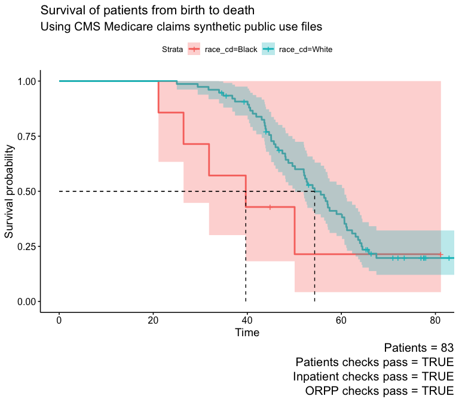

Using R to derive robust insights from real-world healthcare data
================

# Load data

-   Delivery = 02
-   ETL version = 02

``` r
tables_02 <- receive_delivery_02()

tables_02_etl_02 <- tables_02 %>%
  etl_02()
```

# QC

## Patients

    ## ✔ All Pass No failures across all 13 Tests!

| fail_n | test                                              | column         | any_fail |
|-------:|:--------------------------------------------------|:---------------|:---------|
|      0 | Key columns exist                                 | birth_dt       | FALSE    |
|      0 | Everyone born after 01-01-1900                    | birth_dt       | FALSE    |
|      0 | Key columns exist                                 | cncr           | FALSE    |
|      0 | Dataset contains patients with and without cancer | cncr           | FALSE    |
|      0 | Key columns exist                                 | death_dt       | FALSE    |
|      0 | Everyone born after 01-01-1900                    | death_dt       | FALSE    |
|      0 | Dataset contains alive and dead patients          | death_observed | FALSE    |
|      0 | Key columns exist                                 | desynpuf_id    | FALSE    |
|      0 | Dataset has only One Row Per Patient (OORP)       | desynpuf_id    | FALSE    |
|      0 | Key columns exist                                 | diabetes       | FALSE    |
|      0 | Key columns exist                                 | race_cd        | FALSE    |
|      0 | Key columns exist                                 | sex_ident_cd   | FALSE    |
|      0 | Dataset contains both Male and Female patients    | sex_ident_cd   | FALSE    |

    ## ✔ All Pass No failures across all 13 Tests!

## Inpatient

    ## ✔ All Pass No failures across all 4 Tests!

| fail_n | test                             | column      | any_fail |
|-------:|:---------------------------------|:------------|:---------|
|      0 | Claim admin is a date            | clm_from_dt | FALSE    |
|      0 | Claim payment amount is positive | clm_pmt_amt | FALSE    |
|      0 | Claim admin is a date            | clm_thru_dt | FALSE    |
|      0 | Key columns exist                | desynpuf_id | FALSE    |

    ## ✔ All Pass No failures across all 4 Tests!

## ORPP

    ## ℹ ORPP | Added 5 var(s) from inpatient:

    ## • has_inpatient_claims = Flag if patient has any inpatient claims

    ## • inpatient_claims_n = Number of inpatient claims

    ## • inpatient_payment_median = Median dollar amount of inpatient claims

    ## • inpatient_payment_min = Minimum dollar amount of inpatient claims

    ## • inpatient_payment_max = Maximum dollar amount of inpatient claims

    ## ℹ ORPP | Added 5 var(s) from prescription:

    ## • has_prescription = Flag if patient has any prescriptions

    ## • prescription_n = Number of prescription events

    ## • prescription_patient_payment_median = Median patient prescription payment
    ##   amount

    ## • prescription_rx_cost_median = Median prescription total cost amount

    ## • prescription_patient_payment_percentage_median = Median percentage of total
    ##   prescription cost paid by patient

    ## ✔ All Pass No failures across all 3 Tests!

| fail_n | test                                                 | column                   | any_fail |
|-------:|:-----------------------------------------------------|:-------------------------|:---------|
|      0 | Patients have non-negative median inpatient payments | inpatient_payment_median | FALSE    |
|      0 | Patients have non-negative median prescription costs | inpatient_payment_median | FALSE    |
|      0 | Patients do not have negative survival time          | survival_years           | FALSE    |

    ## ✔ All Pass No failures across all 3 Tests!

# Cohort

## Attrition Table

| description                       |     n | n_dropped |
|:----------------------------------|------:|----------:|
| Everyone                          | 10000 |        NA |
| Race is white or black            |  9323 |      -677 |
| Is Male                           |  4136 |     -5187 |
| Has Diabetes                      |  1526 |     -2610 |
| Has at least 1000 inpatient costs |   268 |     -1258 |
| Median prescription cost is \> 50 |    83 |      -185 |
| 18 years of age or older          |    83 |         0 |

## Attrition Plot

<!-- -->

# Analyses

## Survival

``` r
# Fit the survival model
#  Follow-up time is survival_years
#  Status indicator is death_observed
#  Stratify results by sex_cd

fit <- survfit(Surv(survival_years, death_observed) ~ race_cd,
  data = cohort_tbl
)

# Create the final Kaplan-Meier curve
ggsurvplot(fit,
           conf.int = TRUE,
           surv.median.line = "hv") +
  labs(title = "Survival of patients from birth to death",
       subtitle = "Using CMS Medicare claims synthetic public use files",
       caption = glue::glue("Patients = {nrow(cohort_tbl)}\nPatients checks pass = {patients_checks_pass}\nInpatient checks pass = {inpatient_checks_pass}\nORPP checks pass = {orpp_checks_pass}"))
```

<!-- -->
